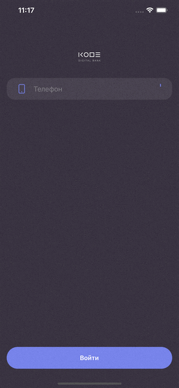
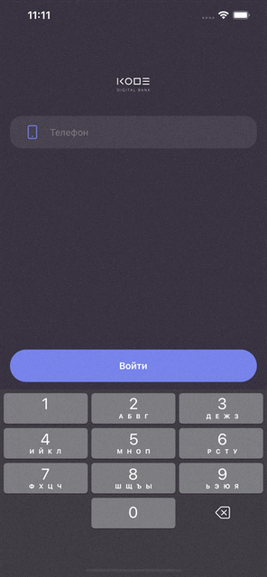
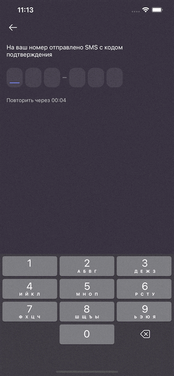
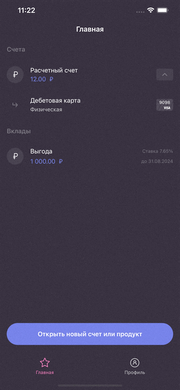
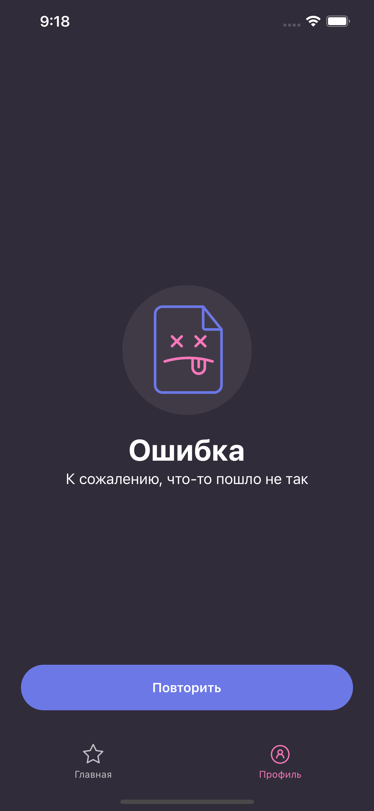
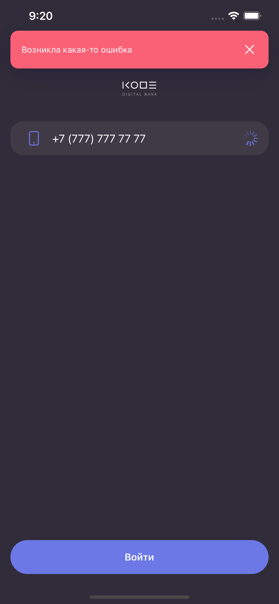
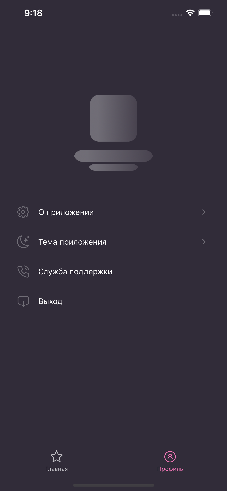
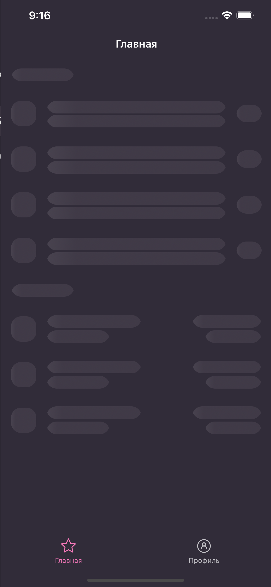

# CODEBank 🏦

CODEBank — это мобильное банковское приложение, разработанное на Swift с использованием архитектуры MVVM. Проект реализует авторизацию, отображение баланса, работу с транзакциями и визуализацию данных. 

## 📌 Основные функции

- Авторизация по номеру телефона и OTP-коду
- Переключение вкладок: транзакции, действия, оплата
- Смена темы приложения (светлая/тёмная)
- Карусель карт с информацией по каждой карте
- Обработка ошибок (нет интернета и серверные)
- Лоадеры, шиммеры и скрытие элементов при загрузке


## 🧰 Технологии

- Swift + UIKit
- MVVM + Coordinators
- Combine
- SwiftGen
- AutoLayout (программно)
- Custom UI Components
- Mock Data + Network Layer (через NetworkRequestManager)
- TableView with Diffable DataSource
- Localizable.strings


## 🚀 Установка

**Среда разработки:** Xcode 14+

1. Клонируйте репозиторий:

   ```bash
   git clone https://github.com/KristelWhite/CODEBank.git
   ```

2. Перейдите в папку проекта и выполните команду для устранения ограничений macOS после распаковки архива:

   ```bash
   sudo xattr -rc .
   ```

3. Установите зависимости через CocoaPods:

   ```bash
   pod install --repo-update
   ```

4. Откройте `.xcworkspace` файл в Xcode, выберите симулятор и запустите проект.


## 📱 Демонстрация приложения

### 🔐 Авторизация



Если ввести неправильный номер:



Превышенно количество неверных попыток ввода:



---

### 💳 Главный экран
Просмотр банковских счетов:


Просмотр карт:



---

### 👤 Профиль
Просмотр и функции на экране профиля:


---

### ❌ Обработка ошибок

Отключение интернета при загрузке профиля:



Ошибка соединения при авторизации:



---

### ✨ Загрузки и шиммер
Шиммер в профиле:



Шиммер на карточке:




## ⚙️ Статус

Проект завершён как финальный для обучения.


## 🔗 Ссылки на материалы

- 🎨 [Дизайн в Figma](https://www.figma.com/file/SLrwkJmbgdWsJ68diapqK5/Skillbox-iOS)
- 📄 [Спецификация API (kode.ru)](https://openapi.kode.ru/docs/kode-bank/apyiaz7qn407r-skillbox-auth-api)

